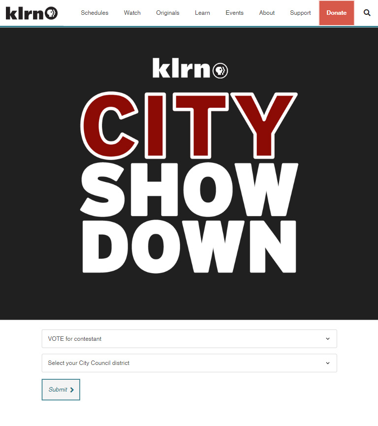
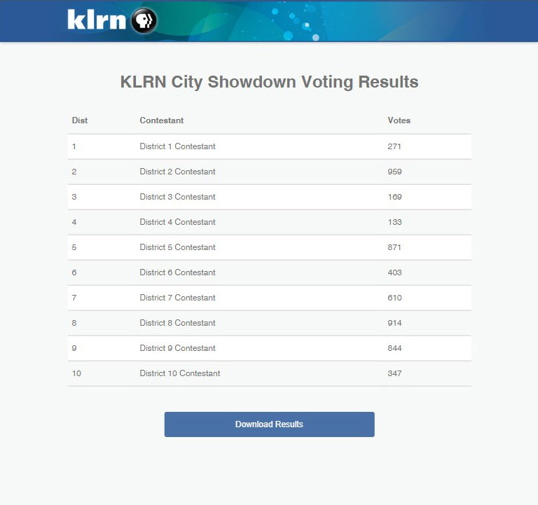

# KLRN City Showdown Voting App

This is a voting app for [KLRN's City Showdown](https://www.klrn.org/events/cityshowdown/), held in March and April of 2023. Residents voted for their favorite performers representing San Antonio City Council districts, with a winner emerging after several rounds. KLRN staff logged into an admin page to view and sort totals and donwload votes.



## Setup

### MySQL database

Here is the SQL code to manually clear and create the database table, using a tool such as phpMyAdmin:

```
DROP TABLE votes;
```

```
CREATE TABLE votes (
    id int NOT NULL AUTO_INCREMENT,
    from_district int NOT NULL,
    to_district int NOT NULL,
    zip varchar(10),
    PRIMARY KEY (id)
);
```

### Admin page

- Add the PHP files to the project root folder on the server
- Add the assets folder to the project root folder on the server
  - Except for /assets/klrn-form.css and /assets/html/index_results.html, which are not needed for production
- Edit contestants.php to include contestants, in in this format: `council_district_number => 'contestant name'`
- Rename config-example.php as config.php
- Edit config.php to add database connection info, voter form's location urls, and a list of users as `'username' => 'password'`

```
<?php
return array(
    'db_host' => 'localhost',
    'db_user' => 'root',
    'db_pass' => '',
    'db_name' => 'klrn_city_showdown',
    'vote_url_dev' => 'vote.html',
    'vote_url_prod' => 'https://www.klrn.org/events/cityshowdown/',
    'users' => ['dev1' => '123',
                'dev2', '234']
);
```

### Front-end voter form component

- In the script at the top of vote.html set the form's action url for `formActionDev` and `formActionProd`
- And set `showThankYou=true` when testing results from database, and to `false` for production
- Also in vote.html, edit the select element that has `id="to_district"` to include contestants for each council district
- Add vote.html to a web page
  - The file here is designed as a [PBS Bento 3 Embed Code](https://docs.pbs.org/display/B3/Embed) for [klrn.org](https://www.klrn.org/)
  - For development, the file injects /assets/klrn-form.css to add additional styles from klrn.org

## Folders and files

- **/assets**
  - **/html** - html templates for admin page (though index_results.html is for mockup only)
  - **/img** - logo and header image for admin page
  - **klrn-form.css** - additional styles from klrn.org that get injected into vote.html only during development
  - **scripts.js** - implements insertion sort for each table column on admin page
  - **styles.css** - for admin page
- **/images** - for README.md
- **admin.html** - mockup only
- **\*.php** - server files to interact with MySQL database, and display and download results
- **sql.txt** - for reference, SQL code used in app
- **vote.html** - HTML, CSS and JavaScript component to manually insert as a [PBS Bento 3 Embed Code](https://docs.pbs.org/display/B3/Embed) for [klrn.org](https://www.klrn.org/)
- **vote-script.html** - script to handle dynamic page elements outside of voting form, such as how many votes to allow, and when to show form, buttons and thank-you message



## References

- [KLRN City Showdown](https://www.klrn.org/cityshowdown/)
- [Bento 3.0 documentation](https://docs.pbs.org/display/B3)
- [Bento 3.0 embed component](https://docs.pbs.org/display/B3/Embed)
